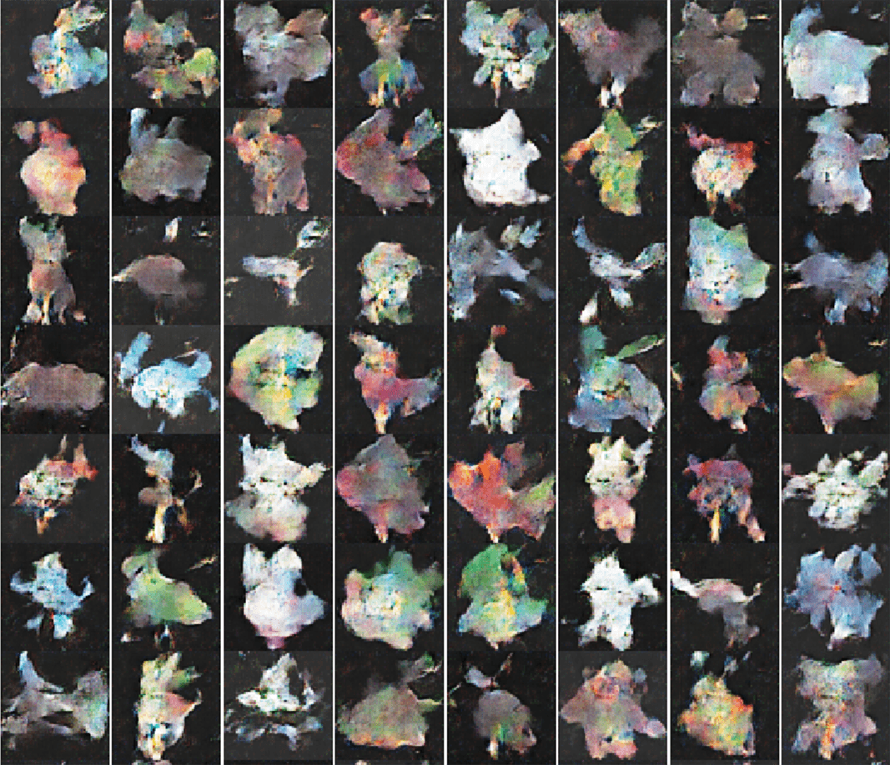

# ImageGenerate

1. Build a DCGAN to generator Pokemon images
2. Build a pix2pix app to get a style transfer network (recently working on)
3. Do some frontend work

# Result
1. Pokemon-ster .....
Unlike face, number, landscape of typical kind, pokemons have too many different shape and color, which makes DCGAN suffer.
We can choose only the yellow pokemon(you can find in folder pokemon\_yellow) to train the network, or you can use a very small batch(like batch\_size < 8). Your generated images will get a little bit better.
If you happen to train your DCGAN with a reletively large batch (say 256), your network will confuse on what you might want it to learn. Adding up 256 different pokemon with different color and shapes will get you mess.

I will try [BEGAN](https://arxiv.org/abs/1703.10717) to handle this problem 

